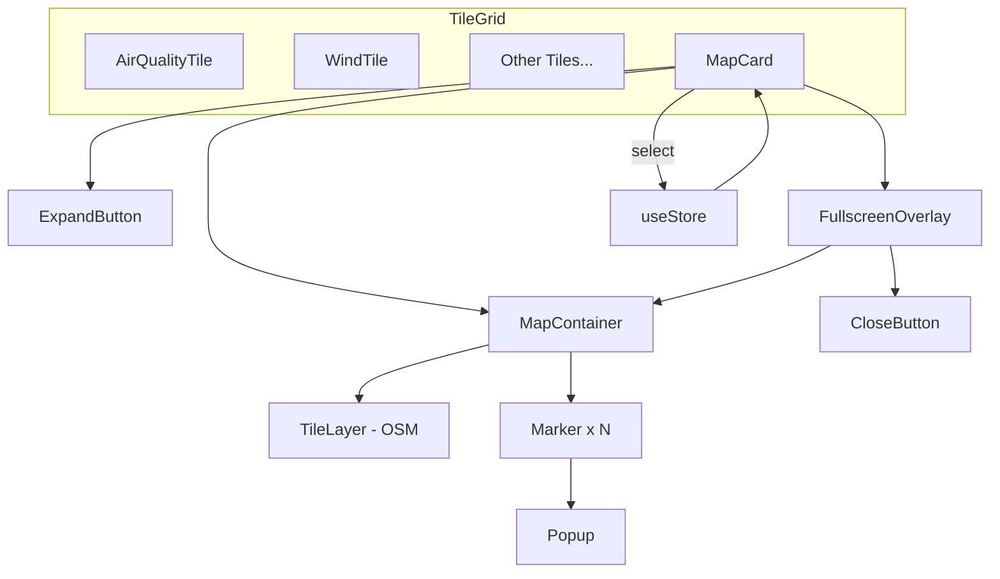

# Design Document: Interactive Map

## Overview

The interactive map feature adds a Leaflet-based map card to the weather dashboard, displaying all saved locations as clickable pins. Users can view location details via popups, expand the map to fullscreen for a broader view, and interact with standard map controls (pan, zoom). The implementation leverages the existing `react-leaflet` and `leaflet` packages already installed in the project.

The MapCard component integrates into the existing TileGrid layout as a full-width card, following the established TileShell visual pattern. It reads location data from the shared store and provides visual feedback for selected, loading, and empty states.

### Key Design Decisions

| Decision | Choice | Rationale |
|----------|--------|-----------|
| Map library | react-leaflet 4.2.1 + leaflet 1.9.4 | Already installed, zero API key, lightweight |
| Tile provider | OpenStreetMap | Free, no registration, sufficient for pin display |
| Marker style | Custom `L.divIcon` with CSS circles | Avoids broken default icon issue in Vite, enables selected/unselected styling |
| Fullscreen approach | Inline conditional render with fixed overlay | Simpler than React portals, keeps map instance alive |
| Icon fix | Explicit `L.Icon.Default` prototype override | Standard Vite/webpack fix for Leaflet's asset path issue |
| Leaflet CSS import | `@import` in `index.css` | Co-locates all CSS imports, avoids JS bundle overhead |
| Test strategy | Mock react-leaflet components | Leaflet requires DOM/canvas; mocking yields fast, deterministic tests |

## Architecture



### Component Hierarchy

```
TileGrid
└── MapCard (new)
    ├── Header (icon + title + ExpandButton)
    ├── MapView (inline: h-280px)
    │   ├── MapContainer
    │   │   ├── TileLayer
    │   │   ├── Marker[] (one per location)
    │   │   │   └── Popup (area, temp, condition)
    │   │   └── MapController (useMap hook for invalidateSize)
    │   └── EmptyOverlay (conditional)
    └── FullscreenOverlay (conditional, fixed)
        ├── MapContainer (reused, resized)
        └── CloseButton
```

### Data Flow

1. `MapCard` calls `useStore()` to access `locations`, `selectedId`, `isLoading`, and `select`.
2. Each `Location` is mapped to a `<Marker>` at `[latitude, longitude]`.
3. Clicking a marker calls `store.select(location.id)` and opens a popup.
4. The `selectedId` determines which marker gets the blue/larger icon vs gray/smaller.
5. `isFullscreen` is local component state — toggled by the expand/close buttons and keyboard.

## Components and Interfaces

### MapCard Component

**File:** `frontend/src/components/MapCard.tsx`

```typescript
interface MapCardProps {
  // No props needed — reads from store directly
}

export function MapCard(): JSX.Element;
```

**Internal State:**
- `isFullscreen: boolean` — controls overlay visibility
- `expandButtonRef: React.RefObject<HTMLButtonElement>` — for focus return

**Hooks Used:**
- `useStore()` — access locations, selectedId, isLoading, select
- `useState` — isFullscreen toggle
- `useEffect` — Escape key listener, focus management
- `useRef` — expand button ref for focus return
- `useCallback` — memoized event handlers

### MapController Sub-component

An internal component rendered inside `<MapContainer>` to access the map instance via `useMap()`:

```typescript
interface MapControllerProps {
  isFullscreen: boolean;
  scrollWheelZoom: boolean;
}

function MapController({ isFullscreen, scrollWheelZoom }: MapControllerProps): null;
```

**Responsibilities:**
- Call `map.invalidateSize()` after a 250ms delay when `isFullscreen` changes to true
- Toggle `scrollWheelZoom` and `doubleClickZoom` on the map instance based on fullscreen state

### Marker Icon Factory

```typescript
function createMarkerIcon(isSelected: boolean): L.DivIcon;
```

Returns a `L.divIcon` with:
- Selected: 24×24px blue (#3b82f6) circle, slight box-shadow
- Unselected: 16×16px gray (#6b7280) circle

### Icon Additions to `icons.tsx`

```typescript
export function MapPinIcon({ className }: IconProps): JSX.Element;
export function ExpandIcon({ className }: IconProps): JSX.Element;
```

### Integration into TileGrid (`Tiles.tsx`)

```typescript
// Added import
import { MapCard } from './MapCard';

// In TileGrid component, after AveragesTile:
<MapCard />
```

### Leaflet CSS Import (`index.css`)

```css
@import 'leaflet/dist/leaflet.css';
```

Added before the `@tailwind` directives.

### Leaflet Default Icon Fix (`MapCard.tsx`)

```typescript
import L from 'leaflet';
import markerIcon2x from 'leaflet/dist/images/marker-icon-2x.png';
import markerIcon from 'leaflet/dist/images/marker-icon.png';
import markerShadow from 'leaflet/dist/images/marker-shadow.png';

L.Icon.Default.mergeOptions({
  iconRetinaUrl: markerIcon2x,
  iconUrl: markerIcon,
  shadowUrl: markerShadow,
});
```

This fixes Leaflet's broken default icon paths when bundled by Vite. Though we use custom `divIcon` for markers, this ensures any default icons (e.g., from plugins) still work.

## Data Models

### Existing Types (no changes)

The feature consumes existing types without modification:

```typescript
// From types.ts — consumed by MapCard
interface Location {
  id: number;
  latitude: number;
  longitude: number;
  created_at: string;
  weather: WeatherSnapshot;
}

interface WeatherSnapshot {
  condition: string | null;
  area: string | null;
  temperature_c: number | null;
  // ... other fields not used by MapCard
}
```

### Store Interface (consumed, not modified)

```typescript
// From useStore() — fields used by MapCard
{
  locations: Location[];
  selectedId: number | null;
  isLoading: boolean;
  select: (id: number | null) => void;
}
```

### MapCard Internal Types

```typescript
// Popup display data derived from Location
interface MarkerDisplayData {
  id: number;
  position: [number, number];  // [lat, lng]
  label: string;               // area or "lat, lng"
  temperature: string;         // "25°" or "--"
  condition: string;           // condition or "No data"
  isSelected: boolean;
}
```

### Map Configuration Constants

```typescript
const MAP_CENTER: [number, number] = [1.3521, 103.8198]; // Singapore
const MAP_ZOOM = 11;
const MAP_MIN_ZOOM = 10;
const MAP_MAX_ZOOM = 18;
const INLINE_HEIGHT = '280px';
const TILE_URL = 'https://{s}.tile.openstreetmap.org/{z}/{x}/{y}.png';
const TILE_ATTRIBUTION = '&copy; <a href="https://www.openstreetmap.org/copyright">OpenStreetMap</a> contributors';
```


## Correctness Properties

*A property is a characteristic or behavior that should hold true across all valid executions of a system — essentially, a formal statement about what the system should do. Properties serve as the bridge between human-readable specifications and machine-verifiable correctness guarantees.*

### Property 1: Marker count equals locations length

*For any* array of 0 to 50 Location objects (including locations with null weather fields and coordinates at Singapore boundary edges latitude 1.15–1.47, longitude 103.60–104.05), the number of rendered marker elements SHALL equal the length of the locations array.

**Validates: Requirements 1.7, 1.8, 2.2, 2.8, 7.2, 7.8**

### Property 2: Selected icon assignment

*For any* non-empty array of Location objects and any `selectedId` drawn from those locations' IDs, exactly one marker SHALL receive the selected icon (blue, 24×24), and all other markers SHALL receive the unselected icon (gray, 16×16). If `selectedId` is null or does not match any location ID, all markers SHALL receive the unselected icon.

**Validates: Requirements 2.6, 7.7**

### Property 3: Select callback correctness

*For any* Location object rendered as a marker, when that marker's click handler is invoked, the store's `select` function SHALL be called exactly once with that location's `id` value.

**Validates: Requirements 2.3, 7.3**

### Property 4: Location label derivation

*For any* Location object, the derived display label SHALL equal `location.weather.area` when area is a non-null string, or `"${latitude.toFixed(3)}, ${longitude.toFixed(3)}"` when area is null. This label is used both as the popup's first line and the marker's `alt` attribute.

**Validates: Requirements 2.4, 5.6**

## Error Handling

### Tile Layer Load Failure

If OpenStreetMap tiles fail to load (network error, 404, CORS), Leaflet renders a gray canvas. The MapCard does not add custom error handling for tile failures — Leaflet handles this gracefully by default. Markers remain positioned correctly on the blank canvas, and pan/zoom continue to function.

### Empty Store / No Locations

When `locations` is empty and `isLoading` is false, a non-interactive overlay message ("No locations yet. Add one from the sidebar.") renders over the map. The map itself still renders at default center/zoom but no markers are placed.

### Loading State

When `isLoading` is true and `locations` is empty, the map container is replaced with a placeholder div showing "Loading locations…" centered text. This prevents the map from initializing before data is available.

### Null Weather Fields

All weather fields in `WeatherSnapshot` are nullable. The popup formatting handles nulls explicitly:
- `area`: falls back to formatted coordinates
- `temperature_c`: falls back to `"--"`
- `condition`: falls back to `"No data"`

### Focus Management Edge Cases

- If the expand button is removed from the DOM while the overlay is open (unlikely but defensive), focus falls back to `document.body`.
- The Escape key listener is scoped to the fullscreen overlay's lifecycle via `useEffect` cleanup.

## Testing Strategy

### Testing Infrastructure

The existing vitest config (`vitest.config.ts`) only targets backend tests. Frontend tests require:

1. **Add `@testing-library/react` and `@testing-library/jest-dom`** to the root or frontend devDependencies
2. **Add `jsdom`** as a vitest environment dependency
3. **Create** a frontend vitest config or extend the root config with a workspace configuration

The test file `MapCard.test.tsx` will use a file-level vitest comment directive:
```typescript
// @vitest-environment jsdom
```

### Mocking Strategy

Since Leaflet requires a full DOM with canvas/SVG capabilities, all `react-leaflet` components are mocked:

```typescript
vi.mock('react-leaflet', () => ({
  MapContainer: ({ children, ...props }) => <div data-testid="map-container" {...props}>{children}</div>,
  TileLayer: (props) => <div data-testid="tile-layer" {...props} />,
  Marker: ({ children, eventHandlers, ...props }) => (
    <div data-testid="marker" onClick={eventHandlers?.click} {...props}>{children}</div>
  ),
  Popup: ({ children }) => <div data-testid="popup">{children}</div>,
  useMap: () => ({ invalidateSize: vi.fn(), scrollWheelZoom: { enable: vi.fn(), disable: vi.fn() }, doubleClickZoom: { enable: vi.fn(), disable: vi.fn() } }),
}));
```

The store is mocked via a test wrapper that provides controlled values.

### Unit Tests (Example-Based)

| Test Case | Validates |
|-----------|-----------|
| Renders with correct aria attributes | Req 5.1, 5.7 |
| Expand button opens fullscreen overlay | Req 3.3 |
| Close button closes overlay | Req 3.7 |
| Escape key closes overlay | Req 3.8 |
| Backdrop click closes overlay | Req 3.9 |
| Focus moves to close button on open | Req 3.12 |
| Focus returns to expand button on close | Req 3.12, 5.5 |
| Loading state shows placeholder text | Req 6.1 |
| Empty state shows message overlay | Req 6.2 |
| MapContainer has correct inline dimensions | Req 1.4 |
| MapContainer has col-span-full class | Req 1.3 |
| Scroll-wheel zoom disabled in inline mode | Req 4.5 |
| Scroll-wheel zoom enabled in fullscreen | Req 4.6 |

### Property-Based Tests

**Library:** `fast-check` (widely used, mature, TypeScript-native)

Each property test runs a minimum of **100 iterations** with generated inputs.

| Property Test | Tag | Min Iterations |
|---------------|-----|----------------|
| Marker count invariant | Feature: interactive-map, Property 1: Marker count equals locations length | 100 |
| Icon selection invariant | Feature: interactive-map, Property 2: Selected icon assignment | 100 |
| Select callback correctness | Feature: interactive-map, Property 3: Select callback correctness | 100 |
| Location label derivation | Feature: interactive-map, Property 4: Location label derivation | 100 |

**Generator Strategy:**

```typescript
// Location generator for property tests
const locationArb = fc.record({
  id: fc.integer({ min: 1, max: 10000 }),
  latitude: fc.double({ min: 1.15, max: 1.47, noNaN: true }),
  longitude: fc.double({ min: 103.60, max: 104.05, noNaN: true }),
  created_at: fc.constant('2024-01-01T00:00:00Z'),
  weather: fc.record({
    area: fc.oneof(fc.string({ minLength: 1, maxLength: 30 }), fc.constant(null)),
    temperature_c: fc.oneof(fc.double({ min: -10, max: 50, noNaN: true }), fc.constant(null)),
    condition: fc.oneof(fc.string({ minLength: 1, maxLength: 20 }), fc.constant(null)),
    // ... other fields as null constants (not used by MapCard)
  }),
});

const locationsArb = fc.array(locationArb, { minLength: 0, maxLength: 50 });
```

### Test Dependencies to Add

```json
{
  "devDependencies": {
    "@testing-library/react": "^14.0.0",
    "@testing-library/jest-dom": "^6.0.0",
    "jsdom": "^24.0.0",
    "fast-check": "^3.15.0"
  }
}
```
