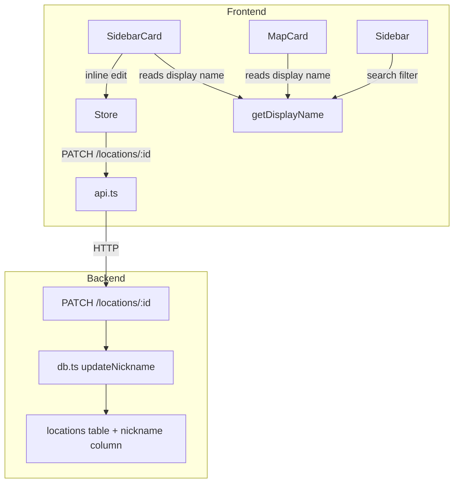

# Design Document: Location Nicknames

## Overview

This feature adds the ability for users to assign custom nicknames to their saved weather locations. The nickname replaces the API-provided area name in all display contexts (sidebar card, map popup) and is searchable. The design introduces a new `nickname` column in the database, a PATCH endpoint for updates, a shared `getDisplayName` utility for consistent name resolution, and inline editing UX on the sidebar card.

The architecture follows the existing patterns: Drizzle ORM schema change with migration, Express route handler, React context store action, and reusable UI components.

## Architecture



**Data flow for nickname update:**
1. User double-clicks the location name on SidebarCard → inline input appears
2. User edits and presses Enter (or blurs the input)
3. Store dispatches `updateNickname(id, nickname)` → calls `api.updateNickname(id, nickname)`
4. Backend PATCH endpoint validates, trims, stores (or nullifies), returns updated record
5. Store updates the location in state → all components re-render with new display name

## Components and Interfaces

### Backend

#### Schema Change (`backend/src/schema.ts`)

Add a nullable `nickname` text column to the `locations` table:

```typescript
nickname: text('nickname'), // nullable, max 50 chars enforced at route level
```

A Drizzle migration will add the column with `ALTER TABLE locations ADD COLUMN nickname TEXT`.

#### Database Layer (`backend/src/db.ts`)

New function:

```typescript
export async function updateNickname(
  id: number,
  nickname: string | null,
): Promise<LocationRecord | null>
```

- Sets `nickname` on the row identified by `id`
- Returns the full `LocationRecord` including the new `nickname` field, or `null` if not found

The `LocationRecord` interface gains a `nickname: string | null` field. The `rowToRecord` function maps it from the row.

#### Route Handler (`backend/src/routes/locations.ts`)

New PATCH `/locations/:locationId` endpoint:

```typescript
router.patch('/locations/:locationId', async (request, response, next) => {
  // 1. Validate locationId exists
  // 2. Validate request body has 'nickname' field of type string
  // 3. Trim the nickname
  // 4. If trimmed is empty → store null
  // 5. If trimmed length > 50 → HTTP 422
  // 6. Otherwise → store trimmed value
  // 7. Return updated location with HTTP 200
});
```

Validation rules:
- Missing `nickname` field or non-string type → HTTP 422
- Trimmed empty / whitespace-only → set to null (clearing the nickname)
- Trimmed length > 50 → HTTP 422
- Location not found → HTTP 404

### Frontend

#### Types (`frontend/src/types.ts`)

```typescript
export interface Location {
  id: number;
  latitude: number;
  longitude: number;
  nickname: string | null;  // NEW
  created_at: string;
  weather: WeatherSnapshot;
}
```

#### API Layer (`frontend/src/api.ts`)

New function:

```typescript
export const updateNickname = (id: number, nickname: string) =>
  request<Location>(`/locations/${id}`, {
    method: 'PATCH',
    body: JSON.stringify({ nickname }),
  });
```

#### Store (`frontend/src/state/store.tsx`)

New action added to `StoreValue`:

```typescript
updateNickname: (id: number, nickname: string) => Promise<void>;
```

Implementation:
1. Call `api.updateNickname(id, nickname)`
2. On success, update the location in the `locations` array with the returned record
3. On failure, throw (caller handles error display)

Optimistic updates are intentionally avoided — the loading indicator on the input provides feedback while the request completes.

#### Shared Utility: `getDisplayName` (`frontend/src/components/format.ts`)

```typescript
export function getDisplayName(location: {
  nickname?: string | null;
  latitude: number;
  longitude: number;
  weather: { area: string | null };
}): string {
  const trimmedNickname = location.nickname?.trim();
  if (trimmedNickname && trimmedNickname.length > 0) {
    return trimmedNickname;
  }
  if (location.weather.area) {
    return location.weather.area;
  }
  return `${location.latitude.toFixed(3)}, ${location.longitude.toFixed(3)}`;
}
```

Resolution priority:
1. Nickname (trimmed, if non-empty)
2. API area name (from weather data)
3. Formatted coordinates (3 decimal places)

This utility is called by `SidebarCard`, `MapCard`, and `Sidebar` (for search matching).

#### SidebarCard Inline Editing

The `SidebarCard` component gains edit state:

```typescript
const [isEditing, setIsEditing] = useState(false);
const [editValue, setEditValue] = useState('');
const [isSaving, setIsSaving] = useState(false);
const [saveError, setSaveError] = useState(false);
```

UX behavior:
- **Activate edit**: Double-click or pencil icon click on the location name
- **Input pre-fill**: Current nickname if set, otherwise empty string
- **Confirm**: Enter key or blur (onBlur) submits the value
- **Cancel**: Escape key discards changes
- **Loading state**: Input disabled + spinner while PATCH in flight
- **Error state**: Brief error indicator (3 seconds), then reverts to previous name
- **Max length**: `maxLength={50}` attribute on the input element

#### MapCard Display

Replace the current inline name resolution:
```typescript
// Before
{location.weather.area ?? `${location.latitude.toFixed(3)}, ${location.longitude.toFixed(3)}`}

// After
{getDisplayName(location)}
```

#### Sidebar Search Filter

Update the filter logic to include nickname:

```typescript
const filtered = useMemo(() => {
  const q = query.trim().toLowerCase();
  if (!q) return locations;
  return locations.filter((location) => {
    const nickname = location.nickname?.toLowerCase() ?? '';
    const area = location.weather.area?.toLowerCase() ?? '';
    const condition = location.weather.condition?.toLowerCase() ?? '';
    return nickname.includes(q) || area.includes(q) || condition.includes(q);
  });
}, [locations, query]);
```

## Data Models

### Database Schema

| Column | Type | Nullable | Default | Constraint |
|--------|------|----------|---------|------------|
| nickname | TEXT | Yes | NULL | Max 50 chars (enforced at API level) |

### API Response Shape

```json
{
  "id": 1,
  "latitude": 1.352,
  "longitude": 103.819,
  "nickname": "Office",
  "created_at": "2024-01-15T10:30:00",
  "weather": { ... }
}
```

### PATCH Request Body

```json
{ "nickname": "Office" }   // set nickname
{ "nickname": "" }          // clear nickname
```

### PATCH Response

Returns the full updated location record (same shape as GET /locations/:id).

## Correctness Properties

*A property is a characteristic or behavior that should hold true across all valid executions of a system — essentially, a formal statement about what the system should do. Properties serve as the bridge between human-readable specifications and machine-verifiable correctness guarantees.*

### Property 1: Nickname storage round-trip

*For any* valid nickname string (1–50 non-whitespace characters after trimming, possibly with leading/trailing whitespace), sending it via PATCH and then retrieving the location should return the trimmed value as the nickname.

**Validates: Requirements 2.1**

### Property 2: Overlong nickname rejection

*For any* string whose trimmed length exceeds 50 characters, the PATCH endpoint should respond with HTTP 422 and the location's nickname should remain unchanged.

**Validates: Requirements 2.3**

### Property 3: Whitespace-only normalization

*For any* string composed entirely of whitespace characters (spaces, tabs, newlines), the PATCH endpoint should set the nickname to null, and the response should contain `nickname: null`.

**Validates: Requirements 2.5**

### Property 4: Invalid type rejection

*For any* value that is not a string type (number, boolean, array, object, null) provided as the `nickname` field, or when the `nickname` field is missing from the request body, the PATCH endpoint should respond with HTTP 422.

**Validates: Requirements 2.6**

### Property 5: Display name resolution priority

*For any* location record, `getDisplayName` should return:
- The trimmed nickname if the nickname is non-null and contains at least one non-whitespace character
- Otherwise the API area name if it is non-null and non-empty
- Otherwise the coordinates formatted as `"{latitude.toFixed(3)}, {longitude.toFixed(3)}"`

**Validates: Requirements 3.1, 3.2, 3.3, 4.1, 4.2, 4.3**

### Property 6: Search filter includes nickname matches

*For any* location with a non-null nickname and any substring of that nickname used as a search query, the location should appear in the filtered results regardless of whether the API area name matches.

**Validates: Requirements 7.1, 7.2, 7.3**

## Error Handling

| Scenario | Backend Response | Frontend Behavior |
|----------|-----------------|-------------------|
| Nickname too long (>50 chars) | HTTP 422, error message | Display validation error, revert input |
| Invalid nickname type | HTTP 422, error message | Should not occur (input always sends string) |
| Location not found | HTTP 404, error message | Display error, revert |
| Network failure | No response | Show error indicator for 3s, revert name |
| Request timeout (>10s) | No response | Show error indicator for 3s, revert name |
| Database write failure | HTTP 500 | Show error indicator for 3s, revert name |

Frontend error handling strategy:
- The inline edit component catches errors from the store's `updateNickname` action
- On error: set `saveError = true`, display a red border or icon for 3 seconds, then revert the displayed name to the previous value
- The loading state (`isSaving`) prevents double-submission

## Testing Strategy

### Unit Tests (Example-based)

| Test | Covers |
|------|--------|
| PATCH with valid nickname returns 200 and updated record | Req 2.1 |
| PATCH with empty string clears nickname to null | Req 2.2 |
| PATCH to non-existent location returns 404 | Req 2.4 |
| Created location has nickname: null | Req 1.2 |
| GET /locations includes nickname field | Req 1.3 |
| SidebarCard edit: double-click opens input | Req 5.1 |
| SidebarCard edit: Enter confirms | Req 5.2 |
| SidebarCard edit: empty submit clears nickname | Req 5.3, 6.1 |
| SidebarCard edit: Escape cancels | Req 5.4 |
| SidebarCard edit: loading state while saving | Req 5.5 |
| SidebarCard edit: error reverts | Req 5.6, 6.4 |
| Empty search query shows all locations | Req 7.4 |

### Property-Based Tests (fast-check)

The project already has `fast-check` as a dev dependency. Each property test runs a minimum of 100 iterations.

| Property Test | Design Property | Tag |
|---------------|-----------------|-----|
| Valid nicknames stored as trimmed | Property 1 | Feature: location-nicknames, Property 1: Nickname storage round-trip |
| Overlong nicknames rejected | Property 2 | Feature: location-nicknames, Property 2: Overlong nickname rejection |
| Whitespace-only normalized to null | Property 3 | Feature: location-nicknames, Property 3: Whitespace-only normalization |
| Invalid types rejected | Property 4 | Feature: location-nicknames, Property 4: Invalid type rejection |
| getDisplayName resolution priority | Property 5 | Feature: location-nicknames, Property 5: Display name resolution priority |
| Search filter includes nickname matches | Property 6 | Feature: location-nicknames, Property 6: Search filter includes nickname matches |

### Test Configuration

- Backend property tests: use Vitest + fast-check, test the route handler with supertest
- Frontend property tests: use Vitest + fast-check, test `getDisplayName` as a pure function
- Frontend search property test: test the filter logic as a pure function extracted from the Sidebar component
- Minimum 100 iterations per property test
- Tag format: `// Feature: location-nicknames, Property {N}: {title}`
