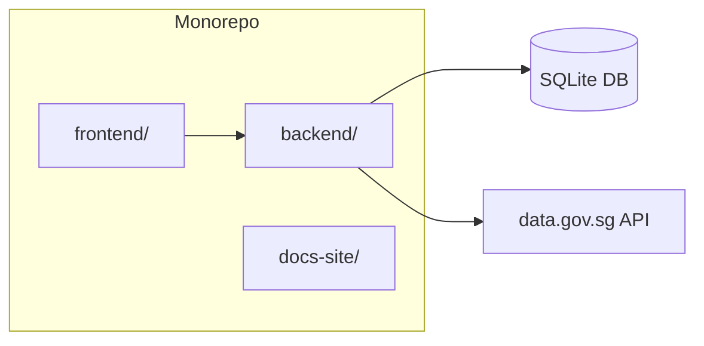
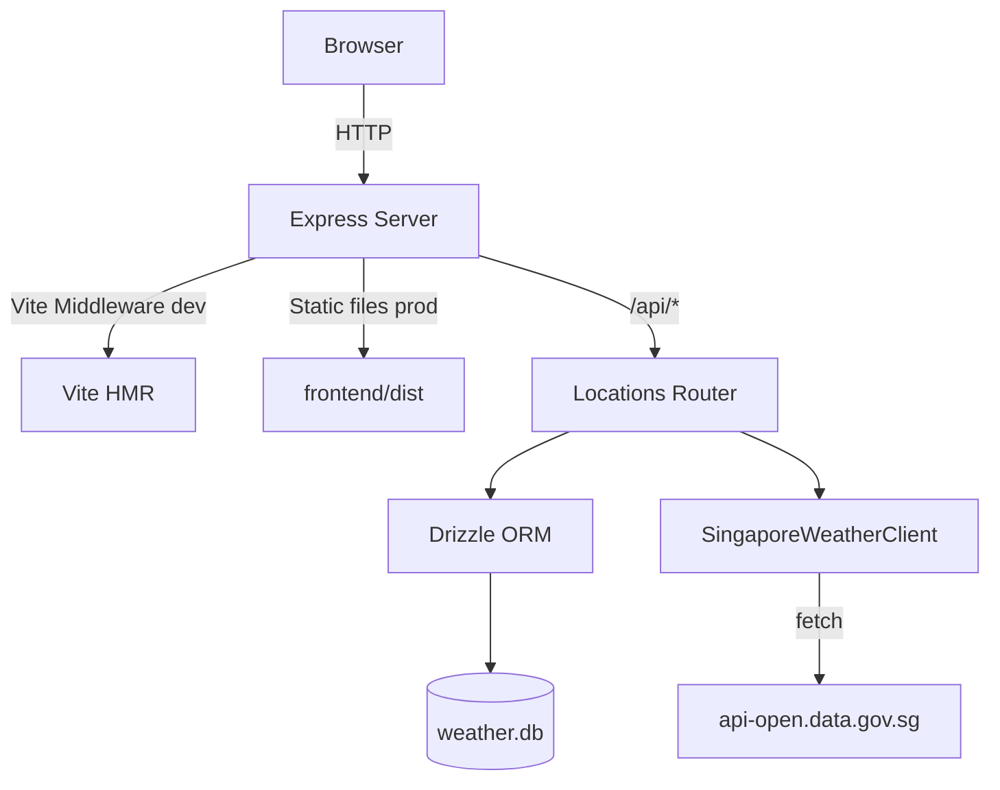
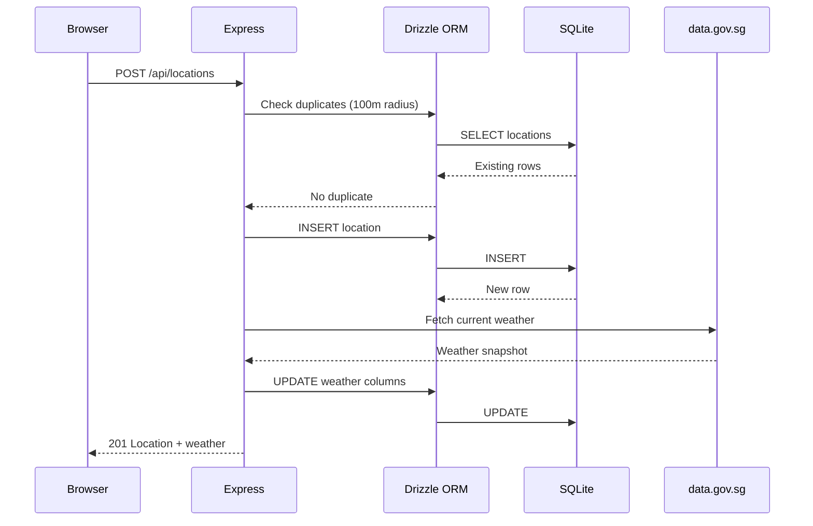
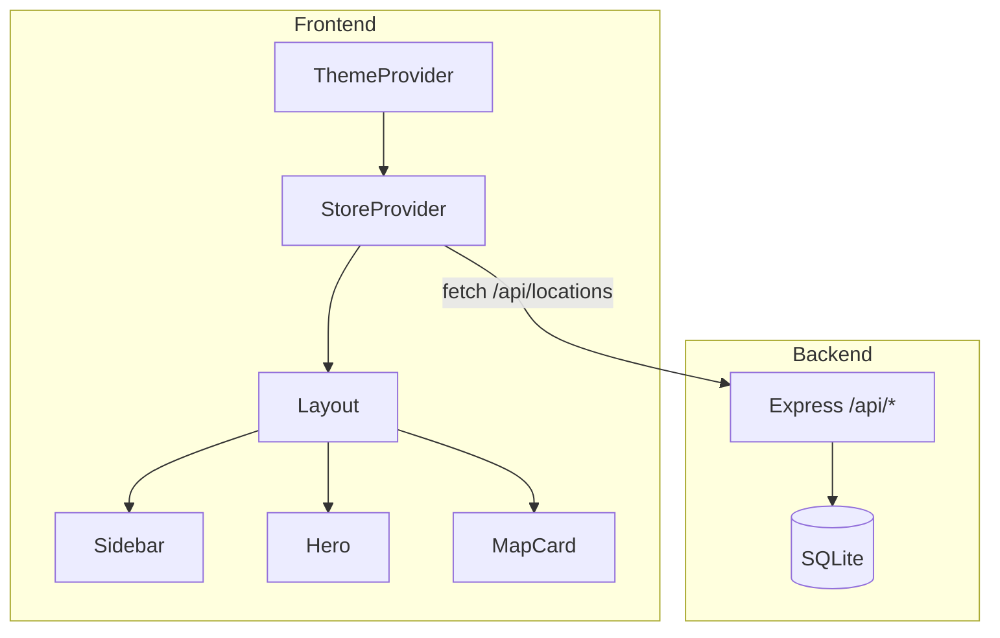

## System Overview

Weather Starter is an npm workspaces monorepo with three packages:



## High-Level Architecture



## Request Flow



## Tech Stack

| Layer      | Technology                                               |
| ---------- | -------------------------------------------------------- |
| Backend    | Express 4, Node.js native `node:sqlite`, Drizzle ORM    |
| Frontend   | React 18, Vite 7, Tailwind CSS 3, Leaflet + react-leaflet |
| Language   | TypeScript 5.7 (strict mode)                             |
| Database   | SQLite with WAL mode                                     |
| Tests      | Vitest, supertest, Testing Library, fast-check           |
| Lint       | ESLint 9, Prettier 3.8                                   |
| Docs       | Astro Starlight                                          |

## Directory Structure

```
backend/src/
├── server.ts              # Express app factory + Vite middleware
├── routes/locations.ts    # CRUD + refresh endpoints
├── db.ts                  # Drizzle ORM layer, auto-migrations
├── schema.ts              # Drizzle table definition
├── weather.ts             # SingaporeWeatherClient
└── logger.ts              # Pino logger (stdout + file)

frontend/src/
├── App.tsx                # Root: ThemeProvider → StoreProvider → Layout
├── api.ts                 # Typed fetch wrappers for /api/*
├── types.ts               # Shared interfaces
├── state/
│   ├── store.tsx          # React Context for locations + CRUD
│   └── ThemeProvider.tsx  # Theme context + localStorage persistence
└── components/
    ├── Layout.tsx         # Main layout shell
    ├── Hero.tsx           # Weather detail hero section
    ├── Sidebar.tsx        # Location list panel
    ├── SidebarCard.tsx    # Individual location card
    ├── MapCard.tsx        # Leaflet map with markers
    ├── Tiles.tsx          # Weather metric tiles
    ├── HourlyStrip.tsx    # Forecast period strip
    ├── TenDayForecast.tsx # 4-day forecast display
    ├── AddLocationForm.tsx# New location form (map click)
    ├── ThemeSelector.tsx  # Theme picker dropdown
    ├── icons.tsx          # SVG icon components
    └── format.ts          # Display name + formatting utilities
```

## State Management



The frontend uses two independent React Contexts:

- **StoreProvider** — Manages location data, selection state, and CRUD actions via the API
- **ThemeProvider** — Manages theme name, persists to localStorage, applies `data-theme` attribute

## Key Design Patterns

- **Dependency injection** — `createLocationsRouter({ weatherClient })` enables mocking the weather provider in tests
- **Drizzle proxy driver** — Wraps Node.js `DatabaseSync` in a custom callback adapter for Drizzle's sqlite-proxy
- **Auto-migrations** — Database migrations run on every server startup from `backend/drizzle/`
- **Duplicate detection** — Haversine formula rejects new locations within 100 meters of an existing one
