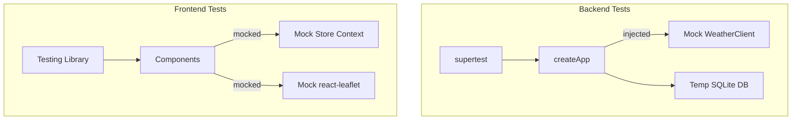

## Running Tests

```bash
npm test                   # All tests, single pass
npm run test:watch         # Watch mode
npx vitest run <path>      # Single file
```

## Configuration

Vitest is configured at the workspace root (`vitest.config.ts`):

- **Includes:** `backend/src/**/*.test.ts` and `frontend/src/**/*.test.{ts,tsx}`
- **Pool:** `forks` with `fileParallelism: false`
- **Env:** `NODE_ENV=test`, `LOG_LEVEL=silent`

## Test Architecture



## Backend Test Patterns

- Use **supertest** against the Express app instance
- Weather client is injected: `createApp({ weatherClient: mockClient })`
- Database uses a temp directory (`mkdtemp`) cleaned up in `afterAll`
- Set `serveFrontend: false` and `enableRequestLogging: false` for test isolation

```ts
const app = await createApp({
  weatherClient: mockClient,
  serveFrontend: false,
  enableRequestLogging: false,
});
```

## Frontend Test Patterns

- Require `// @vitest-environment jsdom` directive at the top of each test file
- Mock `react-leaflet` components as simple `<div>` elements with `data-testid`
- Mock the store via `vi.mock('../state/store', ...)`
- Use `vi.useFakeTimers()` for animation/timeout testing
- Mock `leaflet` itself (`divIcon`, `Icon.Default`)

## Property-Based Tests

- Library: **fast-check**
- Minimum 100 iterations per property
- Used for: marker count invariants, display name resolution, nickname validation
