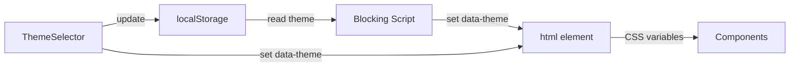

## How It Works

Themes use CSS custom properties on `:root[data-theme="..."]` selectors. Switching themes toggles the `data-theme` attribute on `<html>` — zero component re-renders, only CSS repaints.

A blocking inline script in `index.html` applies the stored theme before first paint to prevent flash of unstyled content (FOUC).



## Available Themes

`apple`, `midnight`, `sunrise`, `arctic`, `forest`, `terminal`, `pastel`

## CSS Variables Contract

| Variable                         | Purpose                             |
| -------------------------------- | ----------------------------------- |
| `--body-bg`                      | Body background (gradient or solid) |
| `--card-bg`                      | Main content card background        |
| `--card-border`                  | Main content card border            |
| `--sidebar-bg`                   | Sidebar panel background            |
| `--sidebar-card-bg`              | Sidebar card default background     |
| `--sidebar-card-border`          | Sidebar card default border         |
| `--sidebar-card-selected-bg`     | Sidebar card selected background    |
| `--sidebar-card-selected-border` | Sidebar card selected border        |
| `--text-primary`                 | Primary readable text               |
| `--text-secondary`               | Secondary/supporting text           |
| `--text-muted`                   | De-emphasized/hint text             |
| `--accent-color`                 | Interactive accent highlights       |

## Usage in Components

Components consume variables via Tailwind arbitrary values:

```tsx
<div className="bg-[var(--card-bg)] border-[var(--card-border)] text-[var(--text-primary)]">
  ...
</div>
```

Non-color properties (border-radius, backdrop-blur, spacing) are not theme-variable — they stay hardcoded.

## Adding a New Theme

Touch exactly 4 files:

1. **`frontend/src/index.css`** — Add a `:root[data-theme="yourtheme"] { ... }` rule set with all CSS variables
2. **`frontend/src/state/ThemeProvider.tsx`** — Add `'yourtheme'` to the `VALID_THEMES` array
3. **`frontend/index.html`** — Add `'yourtheme'` to the `VALID` array in the blocking script
4. **`frontend/src/components/ThemeSelector.tsx`** — Add a label in `THEME_LABELS`
