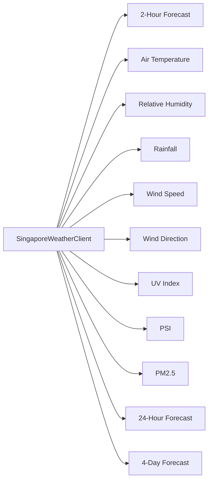

All routes are prefixed with `/api` except the health check.

## Endpoints

| Method | Endpoint                     | Description                           |
| ------ | ---------------------------- | ------------------------------------- |
| GET    | `/api/locations`             | List all saved locations with weather |
| POST   | `/api/locations`             | Create a new location                 |
| GET    | `/api/locations/:id`         | Get a single location                 |
| PATCH  | `/api/locations/:id`         | Update nickname                       |
| DELETE | `/api/locations/:id`         | Delete a location                     |
| POST   | `/api/locations/:id/refresh` | Re-fetch weather from provider        |
| POST   | `/api/logs`                  | Log a frontend interaction event      |
| GET    | `/health`                    | Health check (no `/api` prefix)       |

## POST /api/locations

Create a location and auto-fetch its current weather.

**Request body:**
```json
{ "latitude": 1.3521, "longitude": 103.8198 }
```

**Validation:**
- `latitude` and `longitude` must be numeric
- Must be within Singapore bounds: lat `1.1–1.5`, lon `103.6–104.1`
- Any existing location within 100 meters triggers a `409 Conflict`

**Responses:**
- `201` — Location created (with weather if fetch succeeds)
- `409` — `{ "detail": "Nearby location already exists", "existingLocationId": number }`
- `422` — Validation failure

## GET /api/locations

Returns all saved locations ordered by creation date (newest first).

**Response:**
```json
{
  "locations": [
    {
      "id": 1,
      "latitude": 1.3521,
      "longitude": 103.8198,
      "nickname": "Marina Bay",
      "created_at": "2025-01-15T10:30:00",
      "weather": {
        "condition": "Partly Cloudy",
        "temperature_c": 31.2,
        "humidity_percent": 72,
        "rainfall_mm": 0,
        "...": "..."
      }
    }
  ]
}
```

## PATCH /api/locations/:id

Update a location's nickname.

**Request body:**
```json
{ "nickname": "My Spot" }
```

**Validation:**
- `nickname` must be a string
- Max 50 characters after trimming
- Empty string or whitespace-only clears the nickname (stores `null`)

**Responses:**
- `200` — Updated location
- `404` — Location not found
- `422` — Invalid input

## DELETE /api/locations/:id

**Responses:**
- `204` — Deleted
- `404` — Location not found

## POST /api/locations/:id/refresh

Re-fetch weather data from data.gov.sg and update the stored snapshot.

**Responses:**
- `200` — Updated location with fresh weather
- `404` — Location not found
- `502` — Weather provider error

## Weather Snapshot Shape

Each location includes a `weather` object with:

| Field                    | Type           | Description                          |
| ------------------------ | -------------- | ------------------------------------ |
| `condition`              | string \| null | Current forecast text                |
| `observed_at`            | string \| null | ISO timestamp of observation         |
| `temperature_c`          | number \| null | Air temperature in Celsius           |
| `humidity_percent`       | number \| null | Relative humidity percentage         |
| `rainfall_mm`            | number \| null | Rainfall in millimeters              |
| `wind_speed_knots`       | number \| null | Wind speed in knots                  |
| `wind_direction_degrees` | number \| null | Wind direction in degrees            |
| `forecast_low_c`         | number \| null | 24-hour forecast low temperature     |
| `forecast_high_c`        | number \| null | 24-hour forecast high temperature    |
| `uv_index`               | number \| null | Current UV index                     |
| `psi_twenty_four_hourly` | number \| null | 24-hour PSI reading                  |
| `pm25_one_hourly`        | number \| null | 1-hour PM2.5 reading                 |
| `air_quality_region`     | string \| null | Nearest air quality monitoring region|
| `forecast_periods`       | array          | `{ label, forecast }` per time slot  |
| `daily_forecast`         | array          | `{ date, forecast, temperature_low_c, temperature_high_c }` |

## Data Sources



All data is fetched from the Singapore Government's open data APIs at `api-open.data.gov.sg` and `api.data.gov.sg`.
