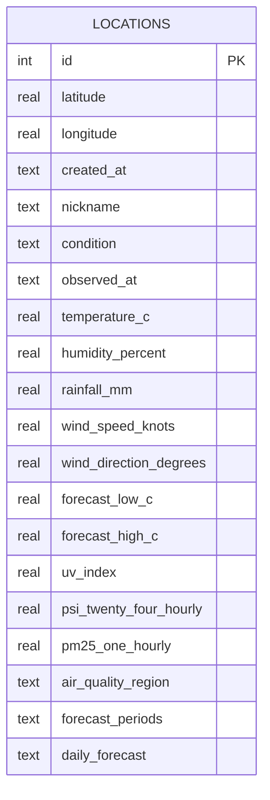

## Overview

- **Engine:** SQLite via Node.js native `node:sqlite` (`DatabaseSync`)
- **ORM:** Drizzle ORM with `sqlite-proxy` driver
- **WAL mode:** Enabled for concurrent read performance
- **File location:** `backend/weather.db` (configurable via `DATABASE_PATH`)

## Schema

Single table: **`locations`**

| Column                 | Type        | Notes                                  |
| ---------------------- | ----------- | -------------------------------------- |
| `id`                   | INTEGER     | Primary key, auto-increment            |
| `latitude`             | REAL        | Not null                               |
| `longitude`            | REAL        | Not null                               |
| `created_at`           | TEXT        | ISO timestamp                          |
| `nickname`             | TEXT        | Nullable, max 50 chars (API-enforced)  |
| `condition`            | TEXT        | Current weather condition text         |
| `observed_at`          | TEXT        | Weather observation timestamp          |
| `source`               | TEXT        | Data source identifier                 |
| `area`                 | TEXT        | Nearest area name                      |
| `valid_period_text`    | TEXT        | Forecast validity period               |
| `temperature_c`        | REAL        | Air temperature                        |
| `humidity_percent`     | REAL        | Relative humidity                      |
| `rainfall_mm`          | REAL        | Rainfall                               |
| `wind_speed_knots`     | REAL        | Wind speed                             |
| `wind_direction_degrees` | REAL     | Wind direction                         |
| `forecast_low_c`       | REAL        | 24h forecast low                       |
| `forecast_high_c`      | REAL        | 24h forecast high                      |
| `uv_index`             | REAL        | UV index                               |
| `psi_twenty_four_hourly` | REAL     | PSI reading                            |
| `pm25_one_hourly`      | REAL        | PM2.5 reading                          |
| `air_quality_region`   | TEXT        | Air quality region name                |
| `forecast_periods`     | TEXT (JSON) | `[{ label, forecast }]`               |
| `daily_forecast`       | TEXT (JSON) | `[{ date, forecast, temp_low, temp_high }]` |

**Unique index** on `(latitude, longitude)`.

## Entity Relationship



## Migrations

```bash
npm run db:generate   # Generate migration after editing backend/src/schema.ts
npm run db:migrate    # Apply pending migrations via drizzle-kit
```

Migrations live in `backend/drizzle/` and are also auto-applied on every server startup via the `migrate()` call in `db.ts`.

## Data Access Layer

The `db.ts` module exports these functions:

| Function           | Description                                          |
| ------------------ | ---------------------------------------------------- |
| `listLocations()`  | All locations ordered by newest first                |
| `createLocation()` | Insert with duplicate check (100m haversine radius)  |
| `getLocation(id)`  | Single location by ID                                |
| `updateWeather()`  | Update all weather columns for a location            |
| `updateNickname()` | Set or clear nickname                                |
| `deleteLocation()` | Remove a location                                    |
| `resetStore()`     | Delete all data (used by `npm run reset`)            |

## Drizzle Proxy Driver

Since Drizzle doesn't have a direct driver for Node.js `DatabaseSync`, the project uses `sqlite-proxy` with a custom callback adapter:

```ts
const sqlite = new DatabaseSync(databasePath);
sqlite.exec('PRAGMA journal_mode = WAL');

const db = drizzle(sqliteCallback, { schema: { locations } });
```

The `sqliteCallback` function maps Drizzle's `run`/`get`/`all`/`values` method calls to the synchronous `DatabaseSync` `prepare()` API.
