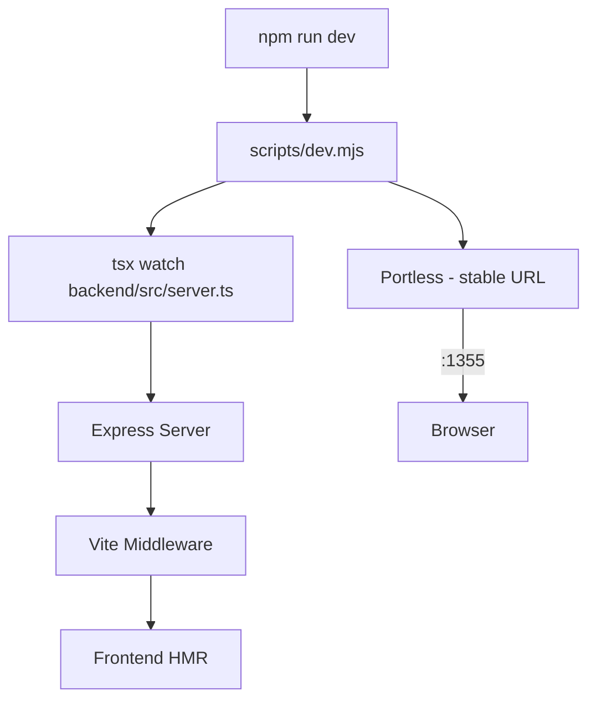
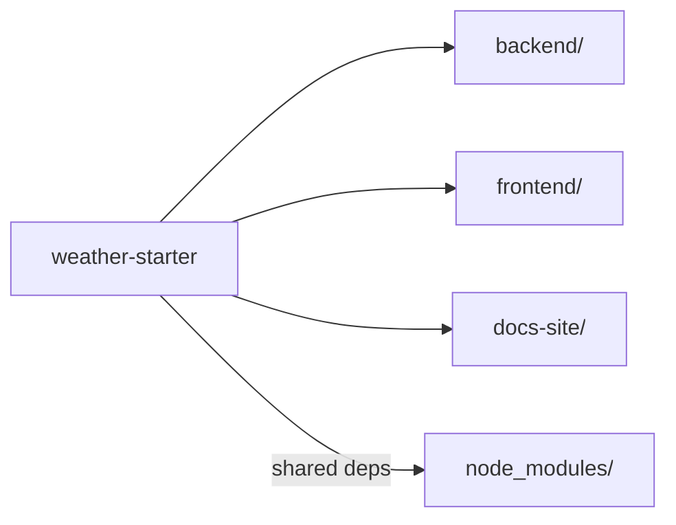

## Environment Variables

| Variable          | Purpose                                   | Default              |
| ----------------- | ----------------------------------------- | -------------------- |
| `WEATHER_API_KEY` | data.gov.sg API key (higher rate limits)  | (none)               |
| `PORTLESS_PORT`   | Local dev server port                     | `1355`               |
| `PORTLESS_HTTPS`  | Enable HTTPS in dev                       | `0`                  |
| `DATABASE_PATH`   | SQLite file path                          | `backend/weather.db` |
| `LOG_FILE_PATH`   | Backend log file path                     | `backend/logs/app.log` |
| `LOG_LEVEL`       | Pino log level                            | `info`               |

Copy `.env.example` to `.env` to configure. The frontend has a separate `.env.local` (from `.env.local.example`) for overriding the backend port during standalone frontend development.

## Development Mode



`npm run dev` runs `scripts/dev.mjs` which:

1. Launches the backend via `tsx watch` (auto-restarts on file changes)
2. Uses **portless** for a stable local URL (default `http://127.0.0.1:1355`)
3. Express embeds Vite middleware in dev mode — the frontend gets full HMR

Both backend and frontend are served from a single process.

## Production Mode

```bash
npm run build    # tsc + vite build
npm run start    # scripts/start.mjs → compiled backend serves static frontend
```

In production, Express serves the Vite-built static files from `frontend/dist/` and handles API routes.

## Git Hooks

**Husky v9** with a pre-commit hook (`.husky/pre-commit`) runs before each commit to enforce code quality.

## Monorepo Structure



The project uses npm workspaces. Shared tooling (TypeScript, ESLint, Vitest, Drizzle Kit) lives at the root. Each workspace has its own `package.json` for workspace-specific dependencies.
